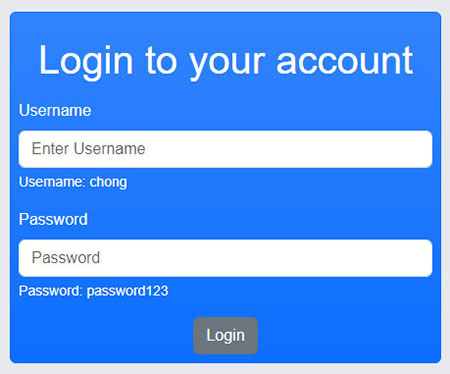
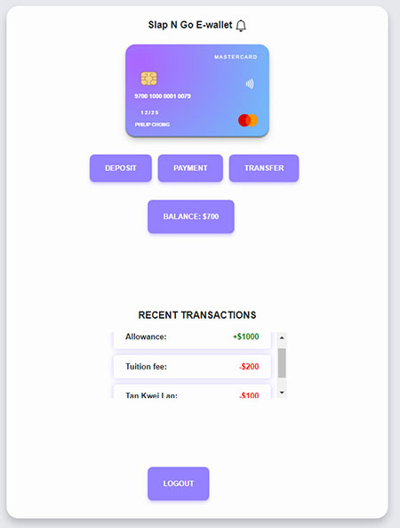

# E-Wallet in React JS

There are two pages in this web app:

1. Login Page:
   

2. Dashboard:
   

After login it will direct to the dashboard where there are:

1. The Deposit button (Once you click it in the Modal Pop up will appear. Then key in your deposit amount and description of the deposit . The deposit amount will reflect in the Balance.)
2. The Payment button (Once you click it in the Modal Pop up will appear. Then key in your payment amount and description of the payment. The payment amount will minus from the deposit and will reflect in the balance.)
3. The Transfer button (Once you click it in the Modal Pop up will appear. Then key in your transfer amount and choose the person name to pay to. The transfer amount will minus from the deposit and will reflect in the balance.)

A special feature in the payment and tranfer Modal Pop up is that if the Balance is less that the payment or transfer amount it will display a error message to you and will require you to top up the deposit.
